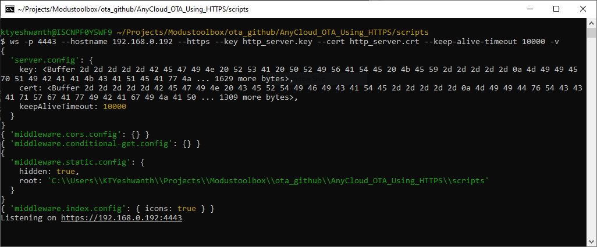
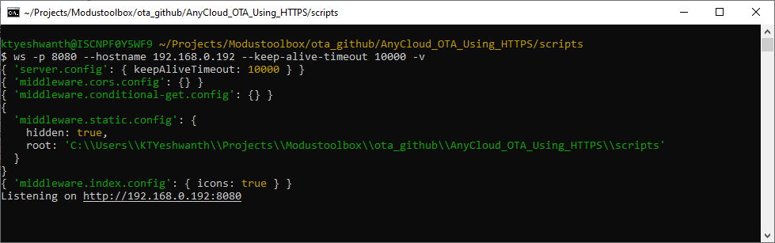
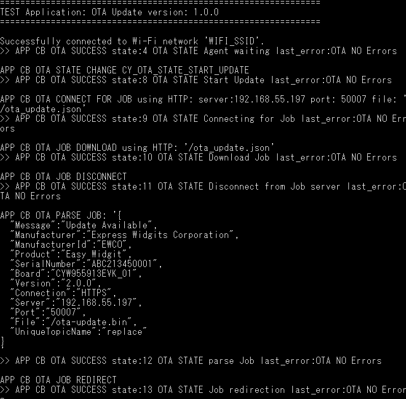
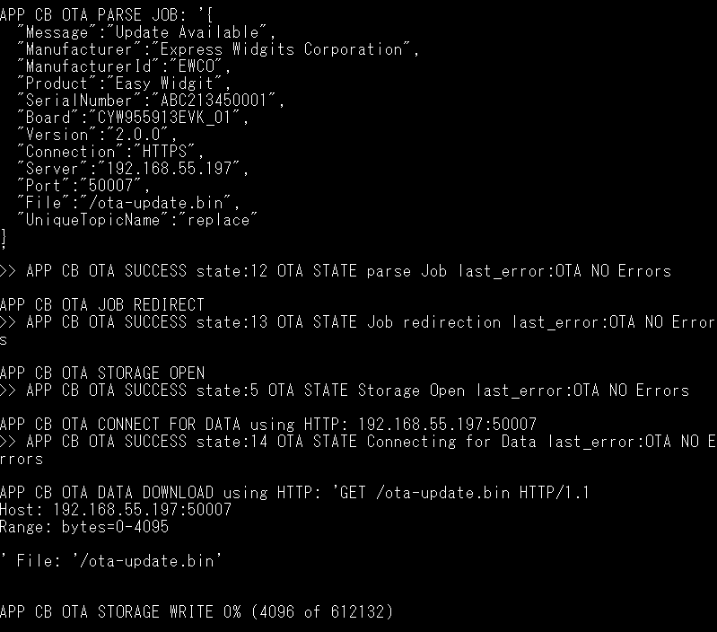
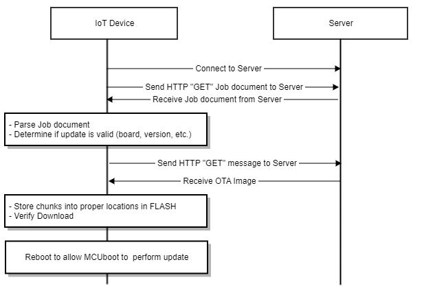

# Over-the-air firmware update using HTTPS

This code example showcases how to perform an HTTP over-the-air (OTA) update using the CYW955913EVK-01 evaluation kit. The device establishes a connection with a designated HTTPS server and periodically checks for a new update using the job document. When a new update is available, it is automatically downloaded and applied. This feature is useful for IoT applications where physical access to devices may be limited, and software updates need to be deployed remotely.

[View this README on GitHub.](https://github.com/Infineon/mtb-example-threadx-wifi-ota-http)

[Provide feedback on this code example.](https://cypress.co1.qualtrics.com/jfe/form/SV_1NTns53sK2yiljn?Q_EED=eyJVbmlxdWUgRG9jIElkIjoiQ0UyMzk2MTQiLCJTcGVjIE51bWJlciI6IjAwMi0zOTYxNCIsIkRvYyBUaXRsZSI6Ik92ZXItdGhlLWFpciBmaXJtd2FyZSB1cGRhdGUgdXNpbmcgSFRUUFMiLCJyaWQiOiJ2ZWxtdXJ1Z2FuIiwiRG9jIHZlcnNpb24iOiIxLjAuMCIsIkRvYyBMYW5ndWFnZSI6IkVuZ2xpc2giLCJEb2MgRGl2aXNpb24iOiJNQ0QiLCJEb2MgQlUiOiJJQ1ciLCJEb2MgRmFtaWx5IjoiV0lGSSJ9)


## Requirements

- [ModusToolbox&trade; software](https://www.infineon.com/modustoolbox) v3.2 or later (tested with v3.2) with ModusToolbox&trade;.
- Board support package (BSP) minimum required version for : v1.0.0.
- Programming language: C
- Associated parts: CYW955913EVK-01


## Supported toolchains (make variable 'TOOLCHAIN')

- GNU Arm&reg; Embedded Compiler v11.3.1 (`GCC_ARM`) – Default value of `TOOLCHAIN`


## Supported kits (make variable 'TARGET')
- [CYW955913EVK-01 Wi-Fi Bluetooth&reg; Prototyping Kit](https://www.infineon.com/CYW955913EVK-01) (`CYW955913EVK-01`)


## Hardware setup

This example uses the kit’s default configuration. See the kit guide to ensure that the kit is configured correctly.

> **Note:** The CYW955513EVK-01 Wi-Fi Bluetooth&reg; prototyping kit ships with KitProg3 version 2.30 installed. ModusToolbox&trade; requires KitProg3. Before using this code example, make sure that the board is upgraded to KitProg3. The tool and instructions are available in the [Firmware Loader](https://github.com/Infineon/Firmware-loader) GitHub repository. If you do not upgrade, you will see an error like "unable to find CMSIS-DAP device" or "KitProg firmware is out of date".


## Software setup

See the [ModusToolbox&trade; tools package installation guide](https://www.infineon.com/ModusToolboxInstallguide) for information about installing and configuring the tools package.


Install a terminal emulator if you don't have one. Instructions in this document use [Tera Term](https://ttssh2.osdn.jp/index.html.en).

This example requires no additional software or tools.


## Using the code example

### Create the project

The ModusToolbox&trade; tools package provides the Project Creator as both a GUI tool and a command line tool.

<details><summary><b>Use Project Creator GUI</b></summary>

1. Open the Project Creator GUI tool.

   There are several ways to do this, including launching it from the dashboard or from inside the Eclipse IDE. For more details, see the [Project Creator user guide](https://www.infineon.com/ModusToolboxProjectCreator) (locally available at *{ModusToolbox&trade; install directory}/tools_{version}/project-creator/docs/project-creator.pdf*).

2. On the **Choose Board Support Package (BSP)** page, select a kit supported by this code example. See [Supported kits](#supported-kits-make-variable-target).

   > **Note:** To use this code example for a kit not listed here, you may need to update the source files. If the kit does not have the required resources, the application may not work.

3. On the **Select Application** page:

   a. Select the **Applications(s) Root Path** and the **Target IDE**.

   > **Note:** Depending on how you open the Project Creator tool, these fields may be pre-selected for you.

   b.	Select this code example from the list by enabling its check box.

   > **Note:** You can narrow the list of displayed examples by typing in the filter box.

   c. (Optional) Change the suggested **New Application Name** and **New BSP Name**.

   d. Click **Create** to complete the application creation process.

</details>

<details><summary><b>Use Project Creator CLI</b></summary>

The 'project-creator-cli' tool can be used to create applications from a CLI terminal or from within batch files or shell scripts. This tool is available in the *{ModusToolbox&trade; install directory}/tools_{version}/project-creator/* directory.

Use a CLI terminal to invoke the 'project-creator-cli' tool. On Windows, use the command-line 'modus-shell' program provided in the ModusToolbox&trade; installation instead of a standard Windows command-line application. This shell provides access to all ModusToolbox&trade; tools. You can access it by typing "modus-shell" in the search box in the Windows menu. In Linux and macOS, you can use any terminal application.

The following example clones the "[mtb-example-ota-https](https://github.com/Infineon/mtb-example-threadx-wifi-ota-http)" application with the desired name "OtaHttps" configured for the *CYW955913EVK-01* BSP into the specified working directory, *C:/mtb_projects*:

   ```
   project-creator-cli --board-id CYW955913EVK-01 --app-id mtb-example-ota-https --user-app-name OtaHttps --target-dir "C:/mtb_projects"
   ```

<mark>Update the above paragraph and commands to match your CE.

The 'project-creator-cli' tool has the following arguments:

Argument | Description | Required/optional
---------|-------------|-----------
`--board-id` | Defined in the <id> field of the [BSP](https://github.com/Infineon?q=bsp-manifest&type=&language=&sort=) manifest | Required
`--app-id`   | Defined in the <id> field of the [CE](https://github.com/Infineon?q=ce-manifest&type=&language=&sort=) manifest | Required
`--target-dir`| Specify the directory in which the application is to be created if you prefer not to use the default current working directory | Optional
`--user-app-name`| Specify the name of the application if you prefer to have a name other than the example's default name | Optional

> **Note:** The project-creator-cli tool uses the `git clone` and `make getlibs` commands to fetch the repository and import the required libraries. For details, see the "Project creator tools" section of the [ModusToolbox&trade; tools package user guide](https://www.infineon.com/ModusToolboxUserGuide) (locally available at {ModusToolbox&trade; install directory}/docs_{version}/mtb_user_guide.pdf).

</details>


### Open the project

After the project has been created, you can open it in your preferred development environment.


<details><summary><b>Eclipse IDE</b></summary>

If you opened the Project Creator tool from the included Eclipse IDE, the project will open in Eclipse automatically.

For more details, see the [Eclipse IDE for ModusToolbox&trade; user guide](https://www.infineon.com/MTBEclipseIDEUserGuide) (locally available at *{ModusToolbox&trade; install directory}/docs_{version}/mt_ide_user_guide.pdf*).

</details>


<details><summary><b>Visual Studio (VS) Code</b></summary>

Launch VS Code manually, and then open the generated *{project-name}.code-workspace* file located in the project directory.

For more details, see the [Visual Studio Code for ModusToolbox&trade; user guide](https://www.infineon.com/MTBVSCodeUserGuide) (locally available at *{ModusToolbox&trade; install directory}/docs_{version}/mt_vscode_user_guide.pdf*).

</details>


<details><summary><b>Keil µVision</b></summary>

Double-click the generated *{project-name}.cprj* file to launch the Keil µVision IDE.

For more details, see the [Keil µVision for ModusToolbox&trade; user guide](https://www.infineon.com/MTBuVisionUserGuide) (locally available at *{ModusToolbox&trade; install directory}/docs_{version}/mt_uvision_user_guide.pdf*).

</details>


<details><summary><b>IAR Embedded Workbench</b></summary>

Open IAR Embedded Workbench manually, and create a new project. Then select the generated *{project-name}.ipcf* file located in the project directory.

For more details, see the [IAR Embedded Workbench for ModusToolbox&trade; user guide](https://www.infineon.com/MTBIARUserGuide) (locally available at *{ModusToolbox&trade; install directory}/docs_{version}/mt_iar_user_guide.pdf*).

</details>


<details><summary><b>Command line</b></summary>

If you prefer to use the CLI, open the appropriate terminal, and navigate to the project directory. On Windows, use the command-line 'modus-shell' program; on Linux and macOS, you can use any terminal application. From there, you can run various `make` commands.

For more details, see the [ModusToolbox&trade; tools package user guide](https://www.infineon.com/ModusToolboxUserGuide) (locally available at *{ModusToolbox&trade; install directory}/docs_{version}/mtb_user_guide.pdf*).

</details>


## Setting up an HTTP/HTTPS server using local-web-server (based on *node.js*)

This code example uses a local server to demonstrate the OTA operation over HTTP/HTTPS. [local-web-server](https://www.npmjs.com/package/local-web-server) is used in this example. It is a lean, modular web server for rapid full-stack development.

The root directory of the OTA application is referred to as *\<OTA Application>* in this document.

1. Download and install [node.js](https://nodejs.org/en/download/). Install with default settings. **Do not tick** the checkbox to install optional tools for native modules.

2. Open a CLI terminal.

   On Linux and macOS, you can use any terminal application. On Windows, open the *modus-shell* app from the Start menu.

3. Navigate to the *\<OTA Application>/scripts/* folder.

4. Generate test certificates

**Note:** Give different Common name for RootCA , server and client certificates.

This section describes the method to generate the keys and certificate using `openssl` for testing. 

a. Generate Root Key `http_ca.key`:

    ```
    openssl ecparam -name prime256v1 -genkey -noout -out http_ca.key
    ```
b. Generate Root Certificate: 

    ```
    openssl req -new -key http_ca.key -x509 -nodes -days 365 -out http_ca.crt
    ```
    
   This command will prompt for necessary information like country code, State etc.

c. Generate Client Key and certificate:

    1. Create Client Key `http_client.key`:
    ```
    openssl ecparam -name prime256v1 -genkey -noout -out http_client.key
    ```

    2. Create CSR :
    ```
    openssl req -new -sha256 -key http_client.key -out http_client.csr
    ```

    3. Create Client Certificate `client.crt`:
    ```
    openssl x509 -req -days 365 -in http_client.csr -CA http_ca.crt -CAkey http_ca.key -CAcreateserial -out http_client.crt
    ```
d. Generate Server Key and certificate:

    1. Create Server Key `http_server.key`:
    ```
    openssl ecparam -name prime256v1 -genkey -noout -out http_server.key
    ```

    2. Create CSR :
    ```
    openssl req -new -sha256 -key http_server.key -out http_server.csr
    ```

    3. Create Server Certificate `server.crt`:
    ```
    openssl x509 -req -days 365 -in http_server.csr -CA http_ca.crt -CAkey http_ca.key -CAcreateserial -out http_server.crt
    ```

e. Execute the following command to install [local-web-server](https://www.npmjs.com/package/local-web-server).

   ```
   npm install -g local-web-server
   ```

f. Start the local HTTP/HTTPS server:

   - **Using the code example in TLS mode (default):** Execute the following command:

      ```
      ws -p 4443 --hostname <local-ip-address-of-your-pc> --https --key http_server.key --cert http_server.crt --keep-alive-timeout 10000 -v
      ```

      Example:
      ```
      ws -p 4443 --hostname 192.168.0.10 --https --key http_server.key --cert http_server.crt --keep-alive-timeout 10000 -v
      ```
      **Figure 1. HTTPS server started in TLS Mode**

      


   - **Using the code example in non-TLS mode:** Execute the following command:

      ```
      ws -p 8080 --hostname <local-ip-address-of-your-pc> --keep-alive-timeout 10000 -v
      ```

      Example:
      ```
      ws -p 8080 --hostname 192.168.0.10 --keep-alive-timeout 10000 -v
      ```

      **Figure 2. HTTPS server started in Non-TLS mode**

      

> **Note:** If you are running a local-web-server server on a device which is maintained by your organization or institution, the firewall settings may not permit you to host a file server on the local network. To verify whether the file server has been hosted properly, from a device connected to the same local network, check the server link on a browser. Browse for `http://<ip-address-noted-earlier>:<port-number-noted-earlier>`; for example: `http://192.168.0.10:8080`. If the files in the *\<OTA Application>/scripts/* directory are listed on the browser page, you have a properly working file server. Do not proceed to the next section without getting the file server to work.

## Operation

1. Connect the board to your PC using the provided USB cable through the KitProg3 USB connector.

2. Edit the *\<OTA Application>/source/ota_app_config.h* file to configure your OTA application:

   1. Modify the connection configuration such as the `WIFI_SSID`, `WIFI_PASSWORD`, and `WIFI_SECURITY` macros to match the settings of your Wi-Fi network. Make sure that the device running the HTTP server and the kit are connected to the same network.

   2. Modify the `HTTP_SERVER` address to match the IP address and `HTTP_SERVER_PORT` of your HTTP server.

   3. By default, this code example uses HTTPS (TLS) protocol. To use the example in HTTP (non-TLS) mode, modify `ENABLE_TLS` to **false** and skip the next step of adding the certificate.

   4. Add the certificates and key:

      1. Open a CLI terminal.

          On Linux and macOS, use any terminal application. On Windows, open the *modus-shell* app from the Start menu.

      2. Navigate the terminal to *\<OTA Application>/scripts/* directory.

      3. Run the *format_cert_key.py* Python script to generate the string format of the *http_ca.crt* file that can be added as a macro. Pass the name of the certificate with the extension as an argument to the Python script:

         ```
         python format_cert_key.py <one-or-more-file-name-of-certificate-or-key-with-extension>
         ```

         Example:
         ```
         python format_cert_key.py http_ca.crt
         ```
      4. Copy the generated string and add it to the `ROOT_CA_CERTIFICATE` macro in the *ota_app_config.h* file per the sample shown.
	      > **Note:** The local-web-server does not authenticate a client through the certificate; this is the reason why the client certificate and client key are not added here. If you use some other server, which can do client-side authentication, add the *http_client.crt* and *http_client.key* files. Also, set the `USING_CLIENT_CERTIFICATE` and `USING_CLIENT_KEY` macros to value **true**.

5. Edit the job document (*\<OTA Application>/scripts/ota_update.json*):

   1. Modify the value of the `Server` to match the IP address of your HTTP server.

   2. Modify the value of the `Board` to match the kit you are using.

   3. In Step 3, if the code example has been configured to work in non-TLS mode: Set the value of `Port` to **8080** and `Connection` to **HTTP**.

6. Program the board using one of the following:

      <details><summary><b>Using Eclipse IDE</b></summary>

      1. Select the application project in the Project Explorer.

      2. In the **Quick Panel**, scroll down, and click **\<Application Name> Program**.
   </details>


   <details><summary><b>In other IDEs</b></summary>

   Follow the instructions in your preferred IDE.
   </details>


   <details><summary><b>Using CLI</b></summary>

     From the terminal, execute the `make program` command to build and program the application using the default toolchain to the default target. The default toolchain and target are specified in the application's Makefile but you can override those values manually:
      ```
      make program TOOLCHAIN=<toolchain>
      ```

      Example:
      ```
      make program TOOLCHAIN=GCC_ARM
      ```
   </details>

    Observe the messages on the UART terminal; wait for the device to make the required connections as shown in Figure 4. Also, the user LED will blink at 1 Hz.

   **Figure 3. Connection to the HTTP server**

   

7. The job document placed in the *\<OTA Application>/scripts/* folder has a value of `Version` as **1.0.0**. Because the OTA application version and the available update version are the same, the update will not happen.

8. Modify the value of the `BLINKY_DELAY_MS` macro to **(100)** in the *\<OTA Application>/source/led_task.c* file and change the app version in the *\<OTA Application>/Makefile* by setting `APP_VERSION_MINOR` to '1'.

9. Build the app (**Do not** program it to the kit). This new image will be published to the HTTP server in the following steps to demonstrate the OTA update.

   <details open><summary><b>Using Eclipse IDE for ModusToolbox&trade;</b></summary>

      1. Select the application project in the Project Explorer.

      2. In the **Quick Panel**, scroll down, and click **Build \<OTA Application> Application**.


10. After a successful build, locate the *mtb-example-threadx-ota-https.bin* file in the */build//Debug* directory.Copy the *mtb-example-threadx-wifi-ota-http.bin* file to the */scripts* directory and rename it to the *ota-update.bin* file.

11. Edit the *\<OTA Application>/scripts/ota_update.json* file to modify the value of `Version` to **1.1.0**.

12. The OTA application now finds the updated Job document, downloads the new image, and places it in the secondary slot. Once the download is complete, issues a soft reset.

    **Figure 4. Image download**

    

13. Observe the terminal for upgrade logs and LED Blink rate . Notice led blink rate and the updated app version in the terminal log once the app is launched on a successful update.
.


## Design and implementation

This example implements two RTOS tasks: OTA client and LED blink. Both these tasks are independent and do not communicate with each other. The OTA client task initializes the dependent middleware and starts the OTA agent. The LED task blinks the user LED at a specified delay.

All the source files related to the two tasks are placed under the *\<OTA Application>/source/* directory:

 File | Description
:-----|:------
*ota_task.c*| Contains the task and functions related to the OTA client.
*ota_task.h* | Contains the public interfaces for the OTA client task.
*led_task.c* | Contains the task and functions related to LED blinking.
*led_task.h* | Contains the public interfaces for the LED blink task.
*main.c* | Initializes the BSP and the retarget-io library, and creates the OTA client and LED blink tasks.
*ota_app_config.h* | Contains the OTA and Wi-Fi configuration macros such as SSID, password, HTTP/HTTPS server details, certificates, and key.

<br>


 File | Description
:-----|:------
*ota_update.json* | OTA job document.
*format_cert_key.py* | Python script to convert certificate/key to string format.

<br>

The *\<OTA Application>/configs/* folder contains other configurations related to the OTA middleware.

The flow of the OTA update feature using HTTP can be represented as shown in Figure 4. The application which needs the OTA updates should run the OTA Agent. The OTA Agent spawns threads to receive OTA updates when available, without intervening with the application's core functionality. 

**Figure 5. Overview of OTA update using HTTPS**




## Related resources

Resources  | Links
-----------|----------------------------------
Device documentation | Contact [Infineon Support](https://www.infineon.com/cms/en/about-infineon/company/contacts/support/) for device documentation
Development kits | Contact [Infineon Support](https://www.infineon.com/cms/en/about-infineon/company/contacts/support/) for kit samples
Libraries on GitHub  | [mtb-pdl-cat5](https://github.com/Infineon/mtb-pdl-cat5) – CYW55913 Peripheral Driver Library (PDL)  <br> [mtb-hal-cat5](https://github.com/Infineon/mtb-hal-cat5) – Hardware Abstraction Layer (HAL) library <br> [retarget-io](https://github.com/Infineon/retarget-io) – Utility library to retarget STDIO messages to a UART port
Tools  | [ModusToolbox&trade;](https://www.infineon.com/modustoolbox) – ModusToolbox&trade; software is a collection of easy-to-use libraries and tools enabling rapid development with Infineon MCUs for applications ranging from wireless and cloud-connected systems, edge AI/ML,embedded sense and control, to wired USB connectivity using PSoC&trade; Industrial/IoT MCUs, AIROC&trade; Wi-Fi and Bluetooth&reg; connectivity devices, XMC&trade; Industrial MCUs, and EZ-USB&trade;/EZ-PD&trade; wired connectivity controllers. ModusToolbox&trade; incorporates a comprehensive set of BSPs, HAL, libraries, configuration tools, and provides support for industry-standard IDEs to fast-track your embedded application development.

<br>


## Other resources

Infineon provides a wealth of data at [www.infineon.com](https://www.infineon.com) to help you select the right device, and quickly and effectively integrate it into your design.


## Document history

Document title: *CE239614* – *mtb-example-threadx-wifi-ota-http*

 Version | Description of change
 ------- | ---------------------
 1.0.0   | New code example

<br>


All referenced product or service names and trademarks are the property of their respective owners.

The Bluetooth&reg; word mark and logos are registered trademarks owned by Bluetooth SIG, Inc., and any use of such marks by Infineon is under license.


---------------------------------------------------------

© Cypress Semiconductor Corporation, 2024. This document is the property of Cypress Semiconductor Corporation, an Infineon Technologies company, and its affiliates ("Cypress").  This document, including any software or firmware included or referenced in this document ("Software"), is owned by Cypress under the intellectual property laws and treaties of the United States and other countries worldwide.  Cypress reserves all rights under such laws and treaties and does not, except as specifically stated in this paragraph, grant any license under its patents, copyrights, trademarks, or other intellectual property rights.  If the Software is not accompanied by a license agreement and you do not otherwise have a written agreement with Cypress governing the use of the Software, then Cypress hereby grants you a personal, non-exclusive, nontransferable license (without the right to sublicense) (1) under its copyright rights in the Software (a) for Software provided in source code form, to modify and reproduce the Software solely for use with Cypress hardware products, only internally within your organization, and (b) to distribute the Software in binary code form externally to end users (either directly or indirectly through resellers and distributors), solely for use on Cypress hardware product units, and (2) under those claims of Cypress's patents that are infringed by the Software (as provided by Cypress, unmodified) to make, use, distribute, and import the Software solely for use with Cypress hardware products.  Any other use, reproduction, modification, translation, or compilation of the Software is prohibited.
<br>
TO THE EXTENT PERMITTED BY APPLICABLE LAW, CYPRESS MAKES NO WARRANTY OF ANY KIND, EXPRESS OR IMPLIED, WITH REGARD TO THIS DOCUMENT OR ANY SOFTWARE OR ACCOMPANYING HARDWARE, INCLUDING, BUT NOT LIMITED TO, THE IMPLIED WARRANTIES OF MERCHANTABILITY AND FITNESS FOR A PARTICULAR PURPOSE.  No computing device can be absolutely secure.  Therefore, despite security measures implemented in Cypress hardware or software products, Cypress shall have no liability arising out of any security breach, such as unauthorized access to or use of a Cypress product. CYPRESS DOES NOT REPRESENT, WARRANT, OR GUARANTEE THAT CYPRESS PRODUCTS, OR SYSTEMS CREATED USING CYPRESS PRODUCTS, WILL BE FREE FROM CORRUPTION, ATTACK, VIRUSES, INTERFERENCE, HACKING, DATA LOSS OR THEFT, OR OTHER SECURITY INTRUSION (collectively, "Security Breach").  Cypress disclaims any liability relating to any Security Breach, and you shall and hereby do release Cypress from any claim, damage, or other liability arising from any Security Breach.  In addition, the products described in these materials may contain design defects or errors known as errata which may cause the product to deviate from published specifications. To the extent permitted by applicable law, Cypress reserves the right to make changes to this document without further notice. Cypress does not assume any liability arising out of the application or use of any product or circuit described in this document. Any information provided in this document, including any sample design information or programming code, is provided only for reference purposes.  It is the responsibility of the user of this document to properly design, program, and test the functionality and safety of any application made of this information and any resulting product.  "High-Risk Device" means any device or system whose failure could cause personal injury, death, or property damage.  Examples of High-Risk Devices are weapons, nuclear installations, surgical implants, and other medical devices.  "Critical Component" means any component of a High-Risk Device whose failure to perform can be reasonably expected to cause, directly or indirectly, the failure of the High-Risk Device, or to affect its safety or effectiveness.  Cypress is not liable, in whole or in part, and you shall and hereby do release Cypress from any claim, damage, or other liability arising from any use of a Cypress product as a Critical Component in a High-Risk Device. You shall indemnify and hold Cypress, including its affiliates, and its directors, officers, employees, agents, distributors, and assigns harmless from and against all claims, costs, damages, and expenses, arising out of any claim, including claims for product liability, personal injury or death, or property damage arising from any use of a Cypress product as a Critical Component in a High-Risk Device. Cypress products are not intended or authorized for use as a Critical Component in any High-Risk Device except to the limited extent that (i) Cypress's published data sheet for the product explicitly states Cypress has qualified the product for use in a specific High-Risk Device, or (ii) Cypress has given you advance written authorization to use the product as a Critical Component in the specific High-Risk Device and you have signed a separate indemnification agreement.
<br>
Cypress, the Cypress logo, and combinations thereof, ModusToolbox, PSoC, CAPSENSE, EZ-USB, F-RAM, and TRAVEO are trademarks or registered trademarks of Cypress or a subsidiary of Cypress in the United States or in other countries. For a more complete list of Cypress trademarks, visit www.infineon.com. Other names and brands may be claimed as property of their respective owners.
